.. A importancia da documentacao no trabalho distribuido documentation master file, created by
   sphinx-quickstart on Mon Oct  4 16:12:55 2021.

.. role:: emphasize
.. role:: lighten

A importância da documentação no trabalho distribuído
=================================================================================

Python Brasil [2021]

.. rst-class:: text-and-picture

Agenda
------

* Quem sou eu?
* A documentação e o manifesto ágil
* Análise e planejamento de solução
* Documentando decisões
* Disseminando em equipes distribuídas
* Escalando times de engenharia via RFCs
* Sphinx
* Documentação em geral
* Perguntas

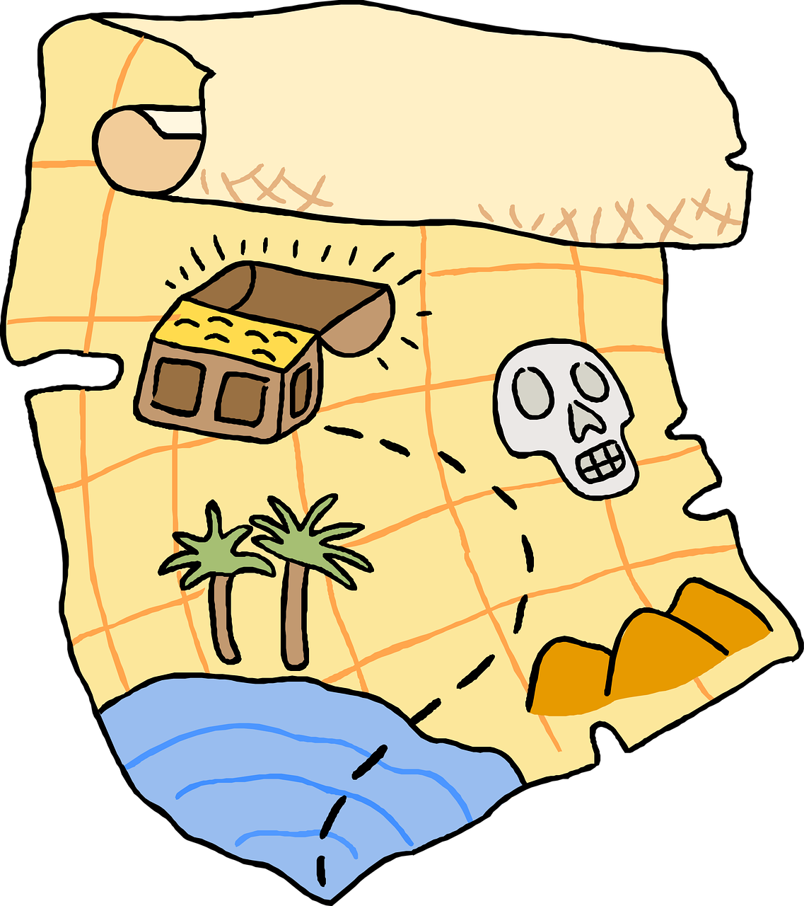

.. rst-class:: citation-reference

Fonte: https://pixabay.com/illustrations/map-treasure-chest-skull-direction-5655572/

.. rst-class:: text-and-picture

Quem sou eu?
------------

* :emphasize:`Vinicius Mendes`
  
    - :emphasize:`13 anos` na área de TI
    - Back-end Python Engineer @ :emphasize:`Loadsmart` desde abr/21
    - Antes: 

        -  Solucione Sistemas
        -  Globo.com
        -  Dataprev
        -  Professor Substituto na UFRN
    
.. image:: _static/profile-picture.jpg
    :width: 380
    :alt: Minha foto com minha estação de trabalho ao fundo

Eu na comunidade Python
-----------------------

- Na lista :code:`django-brasil` desde 2008
- Python Brasil [5] em Caxias do Sul (2009)
- Python Brasil [8] no Rio de Janeiro (2012)
- Python Brasil [10] em Porto de Galinhas (2014)
- Python Brasil 2018 em Natal
- Python Brasil 2021 em |:house:|

.. rst-class::  centered-image-slide
.. nextslide::

.. image:: _static/pythonbrasil-5.jpg
    :width: 800
    :alt: Foto oficial da Python Brasil [5] em Caxias do Sul (2009)
    :align: center

.. rst-class:: citation-reference

Fonte: https://manual-do-big-kahuna.readthedocs.io/

.. rst-class::  centered-image-slide
.. nextslide::

.. image:: _static/pythonbrasil-8.jpg
    :width: 650
    :alt: Foto oficial da Python Brasil [8] no Rio de Janeiro (2012)
    :align: center

.. rst-class:: citation-reference

Fonte: https://manual-do-big-kahuna.readthedocs.io/

.. rst-class:: agile-manifesto

Manifesto ágil
--------------

.. rst-class:: lighten

Estamos descobrindo maneiras melhores de desenvolver
software, fazendo-o nós mesmos e ajudando outros a
fazerem o mesmo. Através deste trabalho, passamos a valorizar:

- :lighten:`Indivíduos e interações mais que processos e ferramentas`
- :emphasize:`Software em funcionamento mais que documentação abrangente`
- :lighten:`Colaboração com o cliente mais que negociação de contratos`
- :lighten:`Responder a mudanças mais que seguir um plano`

.. rst-class:: lighten

Ou seja, mesmo havendo valor nos itens à direita, valorizamos mais os itens à esquerda.

.. rst-class:: agile-manifesto
.. nextslide::

.. rst-class:: lighten

Estamos descobrindo maneiras melhores de desenvolver
software, fazendo-o nós mesmos e ajudando outros a
fazerem o mesmo. Através deste trabalho, passamos a valorizar:

- :lighten:`Indivíduos e interações mais que processos e ferramentas`
- :lighten:`Software em funcionamento mais que documentação abrangente`
- :lighten:`Colaboração com o cliente mais que negociação de contratos`
- :lighten:`Responder a mudanças mais que seguir um plano`

.. rst-class:: emphasize

Ou seja, mesmo havendo valor nos itens à direita, valorizamos mais os itens à esquerda.

.. rst-class:: no-title centered-image-slide

Contexto
--------

.. image:: _static/waterfall.png
    :width: 700
    :alt: Diagrama ilustrando um modelo de desenvolvimento de software em cascata.
    :align: center

.. rst-class:: citation-reference

Fonte: https://en.wikipedia.org/wiki/Waterfall_model

.. rst-class:: no-title centered-diagram-slide
.. nextslide::

.. kroki::
    :type: plantuml

    "Produto" -> "Requisitos": Demanda de produto
    "Requisitos" -> "Produto": Elicitação de requisitos
    "Produto" -> "Requisitos": Aprovação de requisitos
    "Requisitos" -> "Arquitetura": Documento de requisitos
    "Arquitetura" -> "Equipe de desenvolvimento": Documento de arquitetura
    "Equipe de desenvolvimento" -> "Equipe de desenvolvimento": Desenvolve o produto
    "Equipe de desenvolvimento" -> "Testes": Demanda de teste
    "Testes" -> "Testes": Plano de teste
    "Testes" -> "Testes": Suíte de teste
    "Testes" -> "Equipe de desenvolvimento": Relatório de teste
    "Equipe de desenvolvimento" -> "Equipe de desenvolvimento": Correção de bugs
    "Equipe de desenvolvimento" -> "Requisitos": Produto para homologação
    "Requisitos" -> "Produto": Roteiro de homologação
    "Produto" -> "Requisitos": Relatório de homologação

.. rst-class:: centered-title-slide

TL;DR
-----

.. rst-class:: no-title centered-image-slide
.. nextslide::

Análise e planejamento
----------------------

- Entender o :emphasize:`problema`
- Modelar o :emphasize:`domínio`
- Modelar as :emphasize:`operações`
- Qual o :emphasize:`driver`?
    - Time to market? Segurança? Performance?
- Qual o :emphasize:`volume esperado`?
- Identificar as possíveis `integrações`
    - Vai ser :emphasize:`síncrona ou assíncrona`? Por quê?
    - Vamos testar alguma :emphasize:`tecnologia nova`? Por quê?

.. rst-class:: centered-title-slide

Onde você guarda essas decisões?
--------------------------------

.. rst-class:: no-title centered-image-slide
.. nextslide::

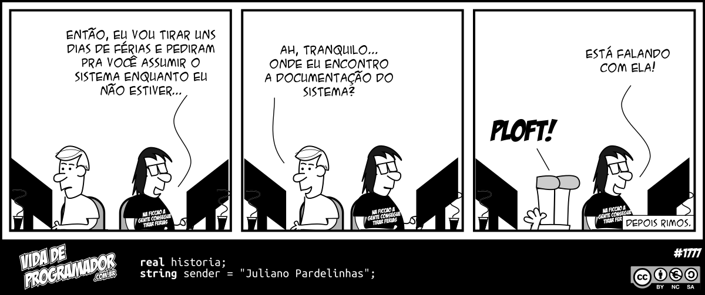

.. rst-class:: citation-reference

Fonte: https://vidadeprogramador.com.br/2018/01/08/documentacao-em-ferias/

.. nextslide::

- :emphasize:`Tire das cabeças` das pessoas
- Emails? Documentos físicos? Quadro?
- Está acessível a todos?
    - Em um :emphasize:`lugar conhecido` por todos?
    - :emphasize:`Fácil de encontrar`?
    - Todos têm :emphasize:`direito a acessar`?
    - Na dúvida, qual a :emphasize:`fonte da verdade`?

.. rst-class:: no-title centered-image-slide
.. nextslide::

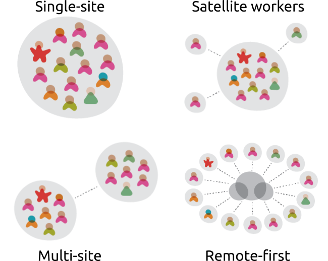

.. rst-class:: citation-reference

Fonte: https://martinfowler.com/articles/remote-or-co-located.html

Ferramentas
-----------

- Armazenamento, compartilhamento e colaboração em :emphasize:`arquivos`
    - Google Drive, OneDrive, etc
- :emphasize:`Wikis`
- :emphasize:`Chat` instantâneo
    - Slack, Discord, Whatsapp, etc
- :emphasize:`Emails`
- :emphasize:`Vídeoconferência`
    - Zoom, Meet, Teams, etc

A tendência natural é :emphasize:`espalharmos` nossa documentação por cada uma dessas ferramentas.

.. rst-class:: centered-title-slide

Colaboração síncrona ou assíncrona?
-----------------------------------

.. rst-class:: no-title centered-image-slide
.. nextslide::

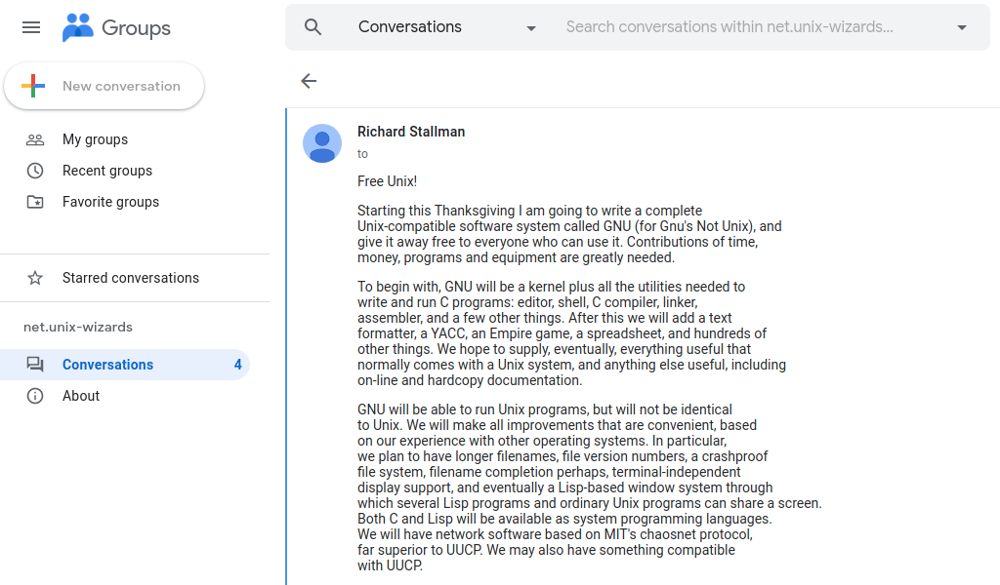

.. rst-class:: citation-reference

Fonte: https://groups.google.com/g/net.unix-wizards/c/8twfRPM79u0/m/1xlglzrWrU0J

.. rst-class:: no-title centered-image-slide
.. nextslide::

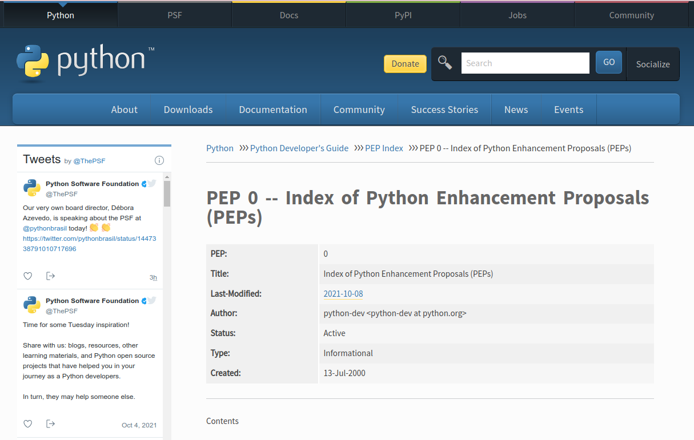

.. rst-class:: citation-reference

Fonte: https://www.python.org/dev/peps/

.. rst-class:: no-title centered-image-slide
.. nextslide::

.. image:: _static/rfc.png
    :width: 600
    :alt: Exemplo de RFC 2026 que explica o processo de padronização da internet
    :align: center

.. rst-class:: citation-reference

Fonte: https://datatracker.ietf.org/doc/html/rfc2026

.. rst-class:: no-title centered-image-slide
.. nextslide::

.. image:: _static/sugestao-rfc.png
    :width: 1000
    :alt: Sugestão de modificação em uma RFC.
    :align: center

.. rst-class:: citation-reference

Fonte: https://datatracker.ietf.org/doc/rfc3667/ballot/

.. rst-class:: centered-title-slide

Escalando times de engenharia via RFCs: anotando coisas
-------------------------------------------------------

.. rst-class:: citation-reference

-- Gergely Orosz: https://blog.pragmaticengineer.com/scaling-engineering-teams-via-writing-things-down-rfcs/

Roteiro
-------

- :emphasize:`Planeje` antes de construir algo novo
- :emphasize:`Capture esse plano` em um pequeno documento escrito
- Selecione algumas pessoas para :emphasize:`comentar e aprovar` esse plano
- :emphasize:`Disponibilize` esse plano :emphasize:`para todos` os envolvidos
- :emphasize:`Dissemine a cultura` na organização

.. rst-class:: centered-title-slide

Utilize ferramentas colaborativas
---------------------------------

.. rst-class:: no-title centered-image-slide
.. nextslide::

.. rst-class:: citation-reference

https://excalidraw.com/

.. rst-class:: no-title centered-image-slide
.. nextslide::

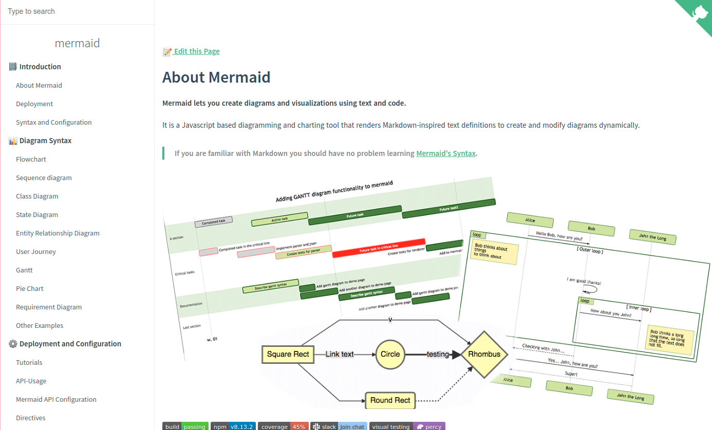

.. rst-class:: citation-reference

https://mermaid-js.github.io/mermaid/#/

.. rst-class:: no-title centered-image-slide
.. nextslide::

.. rst-class:: citation-reference

https://mermaid-js.github.io/mermaid-live-editor/

.. rst-class:: no-title centered-image-slide
.. nextslide::

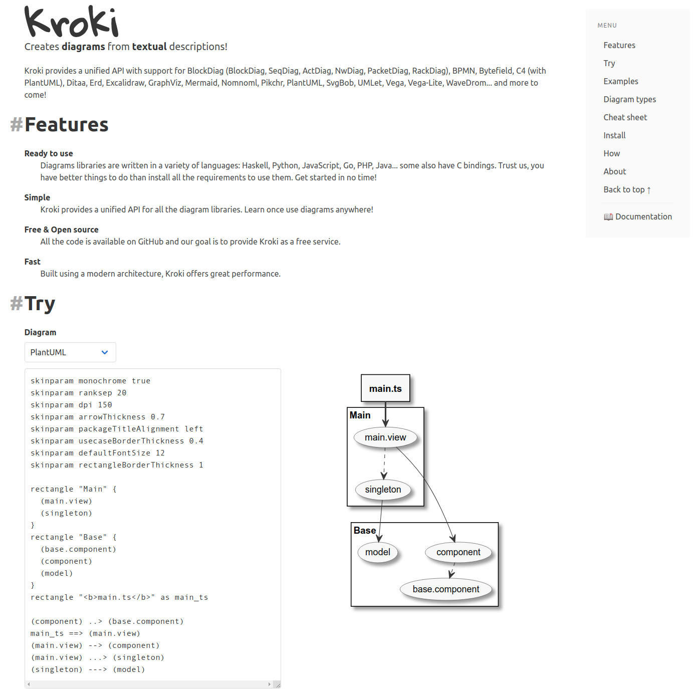

.. rst-class:: citation-reference

https://kroki.io/

.. rst-class:: no-title centered-image-slide
.. nextslide::

.. image:: _static/kroki_cheatsheet_20210515_v1.1_EN.jpg
    :width: 1000
    :alt: Cheatsheet de diagramas Kroki
    :align: center

.. rst-class:: citation-reference

Fonte: https://kroki.io/assets/kroki_cheatsheet_20210515_v1.1_EN.jpeg

.. rst-class:: no-title centered-image-slide
.. nextslide::

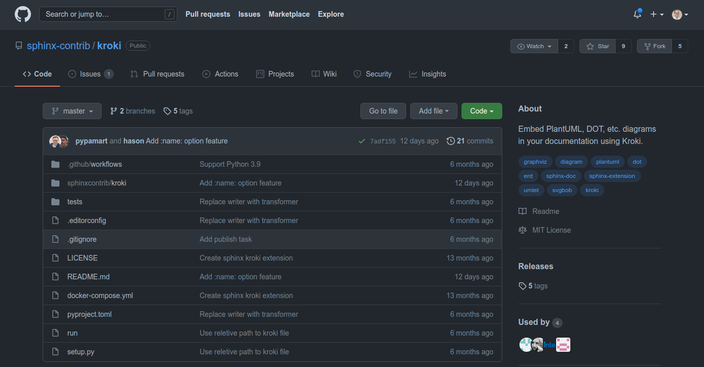

.. rst-class:: citation-reference

https://github.com/sphinx-contrib/kroki

.. rst-class:: no-title centered-image-slide
.. nextslide::

.. rst-class:: citation-reference

https://www.sphinx-doc.org/en/master/

.. rst-class:: no-title centered-image-slide
.. nextslide::

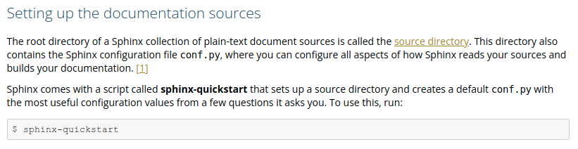

E aprenda um pouco de reStructured Text.

.. rst-class:: citation-reference

| https://www.sphinx-doc.org/en/master/usage/quickstart.html
| https://rest-sphinx-memo.readthedocs.io/en/latest/ReST.html
| https://docutils.sourceforge.io/rst.html

.. rst-class:: centered-image-slide content-below

Github actions
--------------

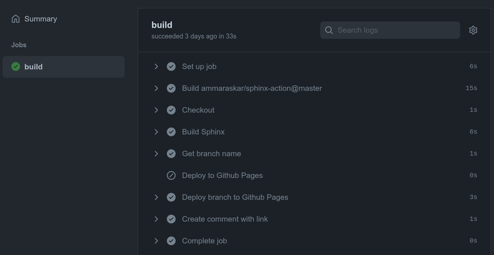

https://vbmendes.github.io/doc-as-code-slides-deck

.. rst-class:: no-title centered-image-slide
.. nextslide::

.. rst-class:: citation-reference

https://docs.djangoproject.com/

Pull request no Github
----------------------

- Ferramenta :emphasize:`familiar`
- Mantém :emphasize:`histórico e rastreabilidade`
- Permite discussão :emphasize:`contextual`
- :emphasize:`Sugestões` de melhoria
- :emphasize:`Aprovações`
- Integra ao :emphasize:`pipeline` de build

.. rst-class:: centered-title-slide

Vamos praticar?
---------------

.. |docs_link| raw:: html

   <a href="https://github.com/vbmendes/doc-as-code-slides-deck" target="_self">https://github.com/vbmendes/doc-as-code-slides-deck</a>

|docs_link|

.. rst-class:: no-title centered-image-slide
.. nextslide::

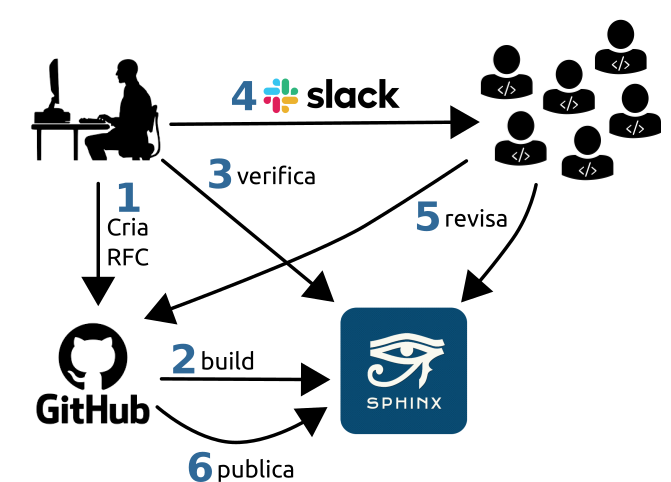

.. rst-class:: citation-reference

Fontes: https://thenounproject.com/term/development-team/1405948/ e https://pxhere.com/en/photo/1445987

.. rst-class:: centered-title-slide

Deu certo?
----------

.. |docs_actions_link| raw:: html

   <a href="https://github.com/vbmendes/doc-as-code-slides-deck/actions" target="_self">https://github.com/vbmendes/doc-as-code-slides-deck/actions</a>

|docs_actions_link|

Benefícios
----------

- Melhor :emphasize:`visibilidade` das decisões
- Tende a gerar :emphasize:`decisões mais embasadas`
- :emphasize:`Disseminação` de conhecimento
- :emphasize:`Responsabilidade compartilhada`
- Facilita o processo de :emphasize:`on-boarding`

.. rst-class:: no-title centered-image-slide

.. nextslide::

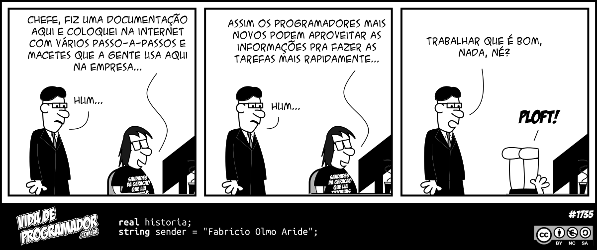

.. rst-class:: citation-reference

Fonte: https://vidadeprogramador.com.br/2017/09/19/fiz-uma-documentacao/

Documentação pode economizar tempo
----------------------------------

- Evite :emphasize:`explicar várias vezes` a mesma coisa
- Se perceber que está fazendo isso, :emphasize:`pare e documente`
- Passe a responder mais com um :emphasize:`link pra documentação`
- Deixe bem documentado e você vai ter :emphasize:`mais tempo para produzir` mais features e documentações.

.. rst-class:: no-title centered-title-slide

Qual é o seu público alvo?
--------------------------

.. rst-class:: no-title centered-title-slide

Qual o contexto prévio necessário?
----------------------------------

.. rst-class:: no-title centered-title-slide

"A maioria dos seus usuários em potencial nunca saberá, porque eles nunca encontrarão seu projeto e, se o encontrarem, não terão ideia de como devem usá-lo."
-------------------------------------------------------------------------------------------------------------------------------------------------------------

.. rst-class:: citation-reference

| Livro: Docs for Developers: An Engineer's Field Guide to Technical Writing (2021)
| por Jared Bhatti, Zachary Sarah Corleissen, Jen Lambourne, David Nunez, Heidi Waterhouse

.. rst-class:: no-title centered-image-slide
.. slide:: 
   :level: 2

    .. image:: _static/code-without-reading-docs.jpg
        :width: 500
        :alt: Meme de um soldado segurando um míssil no ombro com outro segurando uma machadinha para bater no míssil e dispará-lo. Com os dizeres: "Quando você começa a programar em uma nova linguagem sem ler a documentação."
        :align: center

    .. rst-class:: citation-reference

    Fonte: https://twitter.com/code_memez/status/1300377248189407232

.. rst-class:: no-title centered-image-slide
.. slide:: 
   :level: 2

    .. image:: _static/docs-vs-stackoverflow.jpg
        :width: 650
        :alt: Meme falando que desenvolvedores passam 15 minutos lendo documentação e 2 horas no stack overflow.
        :align: center

    .. rst-class:: citation-reference

    Fonte: https://astrologymemes.com/i/read-the-documentation-for-15-minutes-stack-overflow-for-2-2089018d68c149f4b5653486caefbd3a

.. rst-class:: last-slide

Documente a sua solução!
------------------------

Obrigado pela atenção!

Slides publicados em https://vbmendes.github.io/doc-as-code-slides-deck 

E versionados em https://github.com/vbmendes/doc-as-code-slides-deck

Tem algo a adicionar? Abre um :emphasize:`PR` ou me adiciona nas redes sociais:

- github.com/:emphasize:`vbmendes`
- twitter.com/:emphasize:`vbmendes`
- linkedin.com/in/:emphasize:`viniciusmendes`/
- ou me chama no :emphasize:`Discord`

Estamos contratando: https://jobs.lever.co/loadsmart/

.. rst-class:: perguntas

Perguntas?
